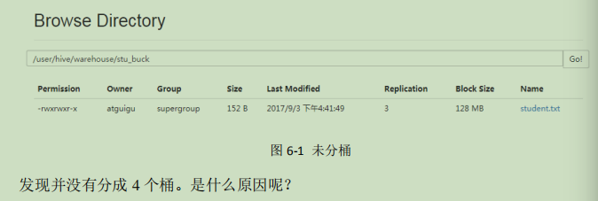

### 一、Hive的基本概念

#### 1.1 介绍

Hive: 由Facebook开源用于解决海量结构化日志的数据统计。

Hive是基于Hadoop的一个数据仓库工具，可以将结构化数据文件映射为一张表，并提供类SQL查询功能。

本质是：将HQL转化为MapReduce程序。

1）Hive 处理的数据存储在HDFS

2)  Hive 分析数据底层的默认实现是MapReduce

3)  执行程序运行在Yarn上。

#### 1.2 Hive的优缺点

* 优点
  1. 操作接口采用类Sql语法，提供快速开发能力.
  2. 避免了去写MapReduce，减少开发人员的学习成本。
  3. Hive的执行延迟比较高，因此Hive常用于数据分析，对实时要求不高的场合。
  4. Hive优势在处理大数据，对于处理小数据没有优势，因为Hive的执行延迟比较高。
  5. Hive支持用户自定义函数，用户可以根据自己的需求来实现自己的函数。
* 缺点
  1. Hive的HQL表达能力有限
     * 迭代式算法无法表达
     * 数据挖掘方面不擅长
  2. Hive的效率比较低
     * Hive自动生成MapReduce作业，通常情况下不够智能化
     * Hive调优比较困难，粒度比较粗

#### 1.3 Hvie架构原理

1. 用户接口：Client

   CLI(hive shell）、JDBC(java 访问Hive)、WEBUI(浏览器访问Hive)

2. 元数据：Metastore

   元数据包含：表名、表所属的数据库、表的拥有者、列/分区字段、表的类型（是否外部表）、表的数据所在目录等；默认存储在自带的derby数据库，推荐使用Mysql存储MetaStore

3. Hadoop

   使用HDFS进行存储，使用MapReduce进行计算。

4. 驱动器：Driver

   * 解析（Sql Parser）：将Sql字符串转换成抽象语法树AST,这一步一般都用第三方工具库完成，比如antlr: 对AST进行语法分析。比如表是否存在、字段是否存在、sql语义是否有误。
   * 编译器（Physical Plan）: 将AST编译生成逻辑执行计划
   * 优化器（Query Optimzer）: 对逻辑执行计划进行优化。
   * 执行器（Execution）: 把逻辑执行计划转换成可以运行的物理计划。对于Hive来说，就是MR/Spark。

   

Hive 通过给用户提供一系列交互接口，接收到用户的指令（SQL），使用自己的Driver，结合元数据（MetaStore）,将这些指令翻译成MapReduce,提交到Hadoop中执行，最后，将执行的结果输出到用户交互接口。

#### 1.4Hive和数据库比较

由于Hive采用了类似于SQL的查询语言（HQL），因此很容易将Hive理解为数据库，其实从结构上来看，Hive和数据除了拥有类似的查询语言，再无类似之处。本节将从多个方面来阐述Hive和数据库的差异。数据库可以用Online的应用中，但是Hive是为了数据仓库而设计的。清楚这一点有助于从应用角度理解Hive的特性。

1. 查询语言

   由于SQL被广泛的应用在数据仓库中，因此，专门针对Hive的特性设计了类SQL的查询语言HQL，熟悉SQL开发的开发者可以很方便的使用Hive进行开发。

2. 数据存储位置

   Hive是建立在Hadoop之上的，所有的Hiv数据都是存储咋HDFS中的。而数据库则可以将数据保存在块设备或者本地文件系统中。

3. 数据更新

   由于Hive是针对数据仓库应用设计的，而数据仓库的内容读多写少的。因此，Hive中不建议对数据的改写，所有的数据都是在加载的时候确定的。而数据库中的数据通常是要经常修改的，因此可以使用insert into ... values添加数据，使用update...set修改数据。

4. 索引

   Hive在加载数据的过程中不会对数据进行任何处理，甚至不会对数据进行扫描，因此也没有对数据中的某些key建立索引。Hive要访问数据满足条件的特定值时。需要暴力扫描整个数据，因此访问延迟较高。由于MapReduce的引入，Hive可以并行访问数据，因此即使没有索引，对于大数据量访问。Hive仍然可以体现出优势。数据库中，通常会针对一个或者及格列建立索引，因此对于少量的特定条件数据的访问，数据库可以有很高的效率，较低的延迟。由于数据访问延迟较高，决定了Hive不适合数据在线查询。

5. 执行

   Hive中大多数的查询的执行是通过Hadoop提供MapReduce来实现的。而数据库通常有自己的执行引擎。

6. 执行延迟

   Hive在查询数据的时候，由于没有索引，需要扫描整个表，因此延迟较高。另外一个导致Hive执行延迟高的因素是MapReduce框架。由于MapReduce本身具有较高的的延迟，因此在利用MapReduce执行Hive查询时，也会有较高的延迟。相对的，数据库的执行延迟较低。当然，这个低是有条件的，即数据规模较小，当数据规模导到超过数据库的处理能力的时候，Hive的并行计算显然能体现出优势。

7. 扩扩展性

   由于Hive是建立在Hadoop之上的，因此Hive的扩展性是和Hadoop的扩展性是一致的。

8. 数据规模

   由于Hive建立在集群上并可以利用MapReduce进行并行计算，因此可以支持很大的规模的数据；对应的，数据库可以支持的数据规模较小。

### 二、 Hive安装

#### 2.1 Hive安装地址

**hive官网地址**

http://hive.apache.org/

**文档查看地址**

https://cwiki.apache.org/confluence/display/Hive/GettingStarted

**下载地址**

http://archive.apache.org/dist/hive/

#### 2.2 Hive安装部署

1. hive 安装及配置

   * 把 apache-hive-1.2.1-bin.tar.gz 上传到 linux 的/opt/software 目录下

   * 解压 apache-hive-1.2.1-bin.tar.gz 到/opt/module/目录下面

   * 修改 apache-hive-1.2.1-bin.tar.gz 的名称为 hive

   * 修改/opt/module/hive/conf 目录下的 hive-env.sh.template 名称为 hive-env.sh

   * 配置 hive-env.sh 文件

     * 配置 HADOOP_HOME 路径

       export HADOOPHOME=/opt/module/hadoop-2.7.2

     * 配置 HIVE_CONF_DIR 路径

       export HIVECONFDIR=/opt/module/hive/conf

2. Hadoop 集群配置

   * 必须要启动hdfs和yarn

     ~~~shell
     [atguigu@hadoop102 hadoop-2.7.2]$ sbin/start-dfs.sh
     [atguigu@hadoop103 hadoop-2.7.2]$ sbin/start-yarn.sh
     ~~~

     

   * 在HDFS上创建/tmp和/user/hive/warehouse 两个目录并修改他们的同组权限可写。（可不操作，系统会自动创建）

     ~~~shell
     [atguigu@hadoop102 hadoop-2.7.2]$ bin/hadoop fs -mkdir /tmp
     [atguigu@hadoop102 hadoop-2.7.2]$ bin/hadoop fs -mkdir -p /user/hive/warehouse
     [atguigu@hadoop102 hadoop-2.7.2]$ bin/hadoop fs -chmod g+w /tmp
     [atguigu@hadoop102 hadoop-2.7.2]$ bin/hadoop fs -chmod g+w 
     /user/hive/warehouse
     ~~~

3. Hive基本操作

   * 启动hive

     ~~~mysql
     bin/hive
     ~~~

   * 查看数据库

     ~~~mysql
     show databases;
     ~~~

   * 打开默认数据库

     ~~~mysql
     use default;
     ~~~

   * 显示default数据库中的表

     ~~~mysql
     show tables;
     ~~~

   * 创建一张表

     ~~~mysql
     create table student(id int, name string);
     ~~~

   * 显示数据库中几张表

     ~~~mysql
     show tables;
     ~~~

   * 向表中插入数据

     ~~~mysql
     insert into student values(1000, "ss");
     ~~~

   * 查看表结构

     ~~~mysql
     desc student;
     ~~~

   * 查询表中数据

     ~~~mysql
     select * from student;
     ~~~

   * 退出hive

     ~~~mysql
     quit;
     ~~~

#### 2.3 将本地导入Hive

需求：

将本地/opt/module/data/student.txt 这个目录下的数据导入到hive的student(id int, name string)

1. 数据准备

   在/opt/module/data这个目录下准备数据

   * 在/opt/module/目录下创建data

     > mkdir data

   * 在/opt/module/datas/目录下创建student.txt文件添加数据

     ~~~shell
     touch student.text
     vi student.txt
     10001 zhang
     10002 li
     10003 zhao
     ~~~

2. Hive实际操作

   ~~~mysql
   # 启动hive
   bin/hive
   # 显示数据库
   show database;
   # 使用default数据库
   use default;
   # 显示default数据库中的表
   show tables;
   # 删除已经创建的表
   drop table student;
   # 创建student表，并声明文件分隔符‘\t’
   creat table student(id int, name string) ROW formatdelimited fields terminated by '\t';
   # 加载/opt/module/data/student.txt文件到student数据库表中
   load data local inpath '/opt/module/data/student.txt' into table student;
   # Hive查询结果
   select * from student;
   ~~~

3. 遇到的问题

   再打开一个客户端窗口启动hive,会产生java.sql.SQLException异常。

   ~~~shell
   Exception in thread "main" java.lang.RuntimeException: 
   java.lang.RuntimeException:
   Unable to instantiate
   org.apache.hadoop.hive.ql.metadata.SessionHiveMetaStoreClien
   t
    at 
   org.apache.hadoop.hive.ql.session.SessionState.start(Session
   State.java:522)
    at 
   org.apache.hadoop.hive.cli.CliDriver.run(CliDriver.java:677)
    at 
   org.apache.hadoop.hive.cli.CliDriver.main(CliDriver.java:621
   )
    at sun.reflect.NativeMethodAccessorImpl.invoke0(Native 
   Method)
    at 
   sun.reflect.NativeMethodAccessorImpl.invoke(NativeMethodAcce
   ~~~

原因是metastore默认存储在自带的derby数据库中，推荐使用MySQL存储Metastore;

#### 2.4 Mysql安装

1. 查看mysql是否安装，如果安装了就卸载mysql
2. 解压
3. 配置

#### 2.5 Hive元数据配置到Mysql

**启动拷贝**

1. 在/opt/software/mysql-libs目录下解压mysql-connector-java-5.1.27.tar.gz驱动包

   ~~~shell
   [root@hadoop102 mysql-libs]# tar -zxvf mysql-connector-java-5.1.27.tar.gz
   ~~~

2. 拷贝mysql-connector-java-5.1.27-bin.jar 到/opt/module/hive/lib

   ~~~shell
   [root@hadoop102 mysql-connector-java-5.1.27]# cp /opt/software/mysql-libs/mysql-connector-java-5.1.27/mysql-connector-java-5.1.27-bin.jar/opt/module/hive/lib/
   ~~~

**配置MetaStore 到Mysql**

1. 在/opt/module/hive/conf目录下创建一个hive-site.xml

   ~~~mysql
   [atguigu@hadoop102 conf]$ touch hive-site.xml
   [atguigu@hadoop102 conf]$ vi hive-site.xml
   ~~~

2. 根据官方文档配置参数，拷贝数据到hive-site.xml文件中

   https://cwiki.apache.org/confluence/display/Hive/AdminManual+MetastoreAdmin

   ~~~xml
   <?xml version="1.0"?>
   <?xml-stylesheet type="text/xsl" href="configuration.xsl"?>
   <configuration>
   <property>
    <name>javax.jdo.option.ConnectionURL</name>
    
   <value>jdbc:mysql://hadoop102:3306/metastore?createDatabaseI
   fNotExist=true</value>
    <description>JDBC connect string for a JDBC 
   metastore</description>
   </property>
   <property>
       <value>com.mysql.jdbc.Driver</value>
    <description>Driver class name for a JDBC 
   metastore</description>
   </property>
   <property>
    <name>javax.jdo.option.ConnectionUserName</name>
    <value>root</value>
    <description>username to use against metastore 
   database</description>
   </property>
   <property>
    <name>javax.jdo.option.ConnectionPassword</name>
    <value>000000</value>
    <description>password to use against metastore 
   database</description>
   </property>
   </configuration>
   ~~~

3. 配置完毕后，如果启动hive异常，可以重新启动虚拟机。（重启后，别忘了启动hadoop集群）

**多窗口启动Hive测试**

1. 先启动MySql

   ~~~shell
   [atguigu@hadoop102 mysql-libs]$ mysql -uroot -p000000
   ~~~

2. 再次打开多个窗口，分别启动hive

   ~~~shell
   mysql> show databases;
   +--------------------+
   | Database |
   +--------------------+
   | information_schema |
   | mysql |
   | performance_schema |
   | test |
   +--------------------+
   [atguigu@hadoop102 hive]$ bin/hive
   ~~~

3. 启动hive后，回到MySql窗口查看数据库，显示增加了metastore数据库

   ~~~shell
   mysql> show databases;
   +--------------------+
   | Database |
   +--------------------+
   | information_schema |
   | metastore |
   | mysql |
   | performance_schema |
   | test |
   +--------------------+
   ~~~

   **HiveJDBC访问**

   1. 启动hiveserver2服务

      ~~~shell
      [atguigu@hadoop102 hive]$ bin/hiveserver2
      ~~~

   2. 启动beeline

      ~~~shell
      [atguigu@hadoop102 hive]$ bin/beeline
      Beeline version 1.2.1 by Apache Hive
      beeline>
      ~~~

   3. 连接hiveserver2

      ~~~shell
      beeline> !connect jdbc:hive2://hadoop102:10000（回车）
      Connecting to jdbc:hive2://hadoop102:10000
      Enter username for jdbc:hive2://hadoop102:10000: atguigu（回车）
      Enter password for jdbc:hive2://hadoop102:10000: （直接回车）
      Connected to: Apache Hive (version 1.2.1)
      Driver: Hive JDBC (version 1.2.1)
      Transaction isolation: TRANSACTION_REPEATABLE_READ
      0: jdbc:hive2://hadoop102:10000> show databases;
      +----------------+--+
      | database_name |
      +----------------+--+
      | default |
      | hive_db2 |
      +----------------+--+
      
      ~~~

**Hive 常用命令**

~~~SHELL
[atguigu@hadoop102 hive]$ bin/hive -help
usage: hive
-d,--define <key=value> Variable subsitution to apply 
to hive
 commands. e.g. -d A=B or --define 
A=B
 --database <databasename> Specify the database to use
-e <quoted-query-string> SQL from command line
-f <filename> SQL from files
-H,--help Print help information
 --hiveconf <property=value> Use value for given property
 --hivevar <key=value> Variable subsitution to apply 
to hive
 commands. e.g. --hivevar A=B
-i <filename> Initialization SQL file
-S,--silent Silent mode in interactive 
shell
-v,--verbose Verbose mode (echo executed SQL 
to the console)
~~~

1. "-e" 不进入hive的交互窗口执行sql语句

   ~~~shell
   bin/hive -e "select id from student;"
   ~~~

2. “-f”执行脚本中sql语句

   ~~~shell
   touch touch hivef.sql
   # 文中写入正确的sql语句
   select * from student;
   # 执行文件中的sql
   bin/hive -f /opt/module/datas/hivef.sql
   # 执行文件转给的语句并将结果写入到文件中
   bin/hive -f /opt/module/datas/hivef.sql > /opt/module/datas/hive_result.txt
   
   ~~~

**Hive 其他命令操作**

1. 在hive cli 命令窗口如何查看hdfs文件系统

   ~~~shell
   dfs -ls / ;
   ~~~

2. 在hive cli命令窗口如何查看本地文件系统

   ~~~shell
   ！ ls /opt/module/datas;
   ~~~

3. 查看hive中输入的所有历史命令

   * 进入到当前用户的根目录/root 或 /home/rison
   * 查看.hivehistory文件

   ~~~shelL
   cat .hivehistory
   ~~~

**Hive常见属性配置**

1. hive 数据仓库位置

   * Default 数据仓库的最原始位置是hdfs的：/user/hive/warehouse路径下。

   * 在仓库目录下，没有对默认的数据库default创建文件夹。如果某张表default数据库，直接在数据仓库目录下创建一个文件夹。

   * 修改default数据仓库原始位置（将hive-default.xml.template如下配置信息拷贝到hive-site.xml文件中）

     ~~~xml
     <property>
     <name>hive.metastore.warehouse.dir</name>
     <value>/user/hive/warehouse</value>
     <description>location of default database for the 
     warehouse</description>
     </property
     ~~~

     配置同组用户有执行权限

     ~~~shell
     bin/hdfs dfs -chmod g+w /user/hive/warehouse
     ~~~

2. 查询后信息显示配置

   * 在hive-site.xml文件中添加如下配置信息，就可以实现显示当前数据库，以及查询表的头信息配置。

     ~~~xml
     <property>
     <name>hive.cli.print.header</name>
     <value>true</value>
     </property>
     <property>
     <name>hive.cli.print.current.db</name>
     <value>true</value>
     </property>
     ~~~

   * 重新启动hive,对比配置前后差异。

     

**Hive 运行日志信息配置**

1. Hive的log默认存放在/tmp/atgugu/hive.log目录下

2. 修改hive的log存放到/opt/module/hive/logs

   * 修改/opt/module/hive/conf/hive-log4j.properties.template改为hive-log4j.properties

   * 在hive-log4j.properties文件中修改log存放位置

     hive.log.dir = /opt/moduel/hive/logs

**参数配置方式**

1. 查看当前所有的配置信息

   ~~~shell
   hive>set;
   ~~~

2. 参数的配置三种方式

   * 配置文件的方式

     默认配置文件：hive-default.xml

     用户自定义配置文件：hive-site.xml

     注意：用户自定义配置会覆盖默认配置，另外，hive也会读入Hadoop的配置，因为Hive是作为Hadoop的客户端启动的，Hive的配置会覆盖hadoop的配置。配置文件的设定对本机启动的进程都有效。

   * 命令行参数方式

     启动Hive时，可以在命令行添加-hiveconf param=value来设定参数。

     例如：

     ~~~python
     [atguigu@hadoop103 hive]$ bin/hive -hiveconf mapred.reduce.tasks=10;
     ~~~

     注意：仅仅对本次hive启动有效

     查看参数设置：

     ~~~shell
     hive(default)> set mapred.reduce.tasks;
     ~~~

   * 参数声明方式

     可以在HQL中使用set关键字来设定参数

     ~~~SHELL
     hive(default)> set mapred.reduce.tasks=100;
     ~~~

     注意：仅仅对本次的hive启动有效

   上述三种设定方式的优先级依次递增，即配置文件<命令行<参数声明。注意某些系统级的参数，例如log4j相关设定，必须用前两种方式设定，因为那些参数的读取在会话建立之前就已经完成了。

   

### 三、Hive数据类型

#### 3.1 基本类型

对于Hive的string类型相当于数据库的varchar类型，该类型是一个可变的字符串，不过她可能声明其中最多能存储多少个字符，理论上可以存储2GB的字符数。

#### 3.2 集合类型

Hive有三种复杂数据类型Array/map和struct。array和map与java中的array和map类似。strcut与语言的struct类似，她封装了一个命名字段集合，复杂数据类型允许任意层次的嵌套。

**案例**

1. 假设某表如下一行，我们用哪个JSON格式来表示其数据结构。在Hive下访问格式为

   ~~~json
   {
    "name": "songsong",
    "friends": ["bingbing" , "lili"] , //列表 Array, 
    "children": { //键值 Map,
    "xiao song": 18 ,
    "xiaoxiao song": 19
    }
    "address": { //结构 Struct,
    "street": "hui long guan" ,
    "city": "beijing" 
    }
   }
   ~~~

   

2. 基于上述数据结构，我们在Hive创建对应的表，并导入数据。

   ~~~shell
   songsong,bingbing_lili,xiao song:18_xiaoxiao song:19,hui long 
   guan_beijing
   yangyang,caicai_susu,xiao yang:18_xiaoxiao yang:19,chao 
   yang_beijing
   ~~~

   注意：map/struct/array里的元素都可以用同一个字符表示，这里用“_”

3. Hive上创建测试表test

   ~~~mysql
   create table test(
      name string,
      friends array<string>,
      children map<string, int>,
      address struct<street:string, city:string>
   )
   row format delimited fields terminated by ','
   collection items terminated by '_'
   map keys terminated by ':'
   lines terminated by '\n'
   
   ~~~

   字段解释：
   row format delimited fields terminated by ',' -- 列分隔符
   collection items terminated by '_' --MAP STRUCT 和 ARRAY 的分隔符(数据分割
   符号)
   map keys terminated by ':' -- MAP 中的 key 与 value 的分隔符
   lines terminated by '\n'; -- 行分隔符

4. 导入文本数据到测试表

   ~~~shell
   load data local inpath "/opt/module/datas/test.txt" into table test;
   ~~~

   

5. 访问三种集合列里的数据，以下分别是Array,map,Struct的访问方式

   ~~~shell
   select friends[1],children["xiao song"],address.city from test
   where name = "songsong";
   OK
   _c0 _c1 city_
   lili 18 beijing
   Time taken: 0.076 seconds, Fetched: 1 row(s)
   ~~~

#### 3.2 类型转化

Hive 的原子数据类型是可以进行隐式转换的，类似于 Java 的类型转换，例如某表达式
使用 INT 类型，TINYINT 会自动转换为 INT 类型，但是 Hive 不会进行反向转化，例如，
某表达式使用 TINYINT 类型，INT 不会自动转换为 TINYINT 类型，它会返回错误，除非使
用 CAST 操作。

1. 隐式类型转换规则如下

   * 任何整数类型都可以隐式地转换为一个范围更广的类型，如tinyint可以转换为int,int可以转换为bigint
   * 所有整数类型、float和string类型都可以隐式地转换为Double.
   * Tinying、smallint、int都可以转换为float
   * boolean 类型不可以转换为任何其他类型。

2. 可以使用cast操作显示数据类型转换

   例如cast ('1' AS INT )将把字符串‘1’转换成整数1；如果强制转换类型失败，如执行cast('X' AS INT),表达式返回NULL。

### 四、DDL数据定义

#### 4.1创建数据库

1. 创建一个数据库，数据库在HDFS上默认存储路径是/user/hive/warehouse/*.db.

   ~~~SHELL
   hive(default)> create database db_hive;
   ~~~

2. 避免要创建的数据库已经存在的错误，在前面增加 **if not exists**判断。（标准写法）

   ~~~mysql
   hive(default)> create database db_hive;
   hive(default)> create database if not exists db_hive;
   ~~~

3. 创建一个数据库，指定数据库存在HDFS的位置

   ~~~mysql
   hive(default)> create database db_hive2 location '/db_hive2.db';
   ~~~

#### 4.2查询数据库

1. 显示数据库

   ~~~mysql
   hive>show databases;
   ~~~

2. 过滤显示查询的数据库

   ~~~mysql
   hive> show databases like 'db_hive*';
   OK
   db_hive
   db_hive1
   ~~~

**查看数据库详情**

1. 显示数据库详情

   ~~~mysql
   hive> desc database db_hive;
   OK
   db_hive
   hdfs://hadoop102:9000/user/hive/warehouse/db hive.db
   atguiguUser
   ~~~

2. 显示数据库详细信息，extended

   ~~~mysql
   hive>desc database extended db_hive;
   OK
   db_hive
   hdfs://hadoop102/:9000/user/hive/warehouse/db_hive.db
   atguiguUeser
   ~~~

3. 切换数据库

   ~~~mysql
   hive(default)> use db_hive;
   ~~~

#### 4.3 修改数据库

用户可以使用**alter database**命令为某个数据库的dbproperties设置键值对属性，来描述这个数据库的属性信息。数据库的其他元数据信息都是不可修改的，包括数据库名和数据库所在的目录位置。

~~~mysql
hive(default)> alter database hive set dbproperties('createtime' = '20200810')
~~~

在hive中查看修改的结果

~~~MYSQL
hive> desc database extended db_hive;
db_name comment location owner_name owner_type 
parameters
db_hive 
hdfs://hadoop102:8020/user/hive/warehouse/db_hive.db 
atguigu USER {createtime=20200810}
~~~

#### 4.4 删除数据库

1. 删除空数据库

   ~~~shell
   hive> drop database db_hive2;
   ~~~

2. 如果删除的数据库不存在，最好采用 if exists 判断数据是否存在

   ~~~mysql
   hive> drop database db_hive;
   hive> drop database if exists db_hvie2;
   ~~~

3. 如果数据库不为空，可以采用cascade命令，强制删除

   ~~~mysql
   hive>drop database db_hive;
   hive>drop database db_hvie cascade;
   ~~~

#### 4.5 创建表

1. 建表语法

   ~~~mysql
   create [external] table [if not exists] tabale_name
   [(col_name data_type [COMMENT col_comment], ...)]
   [COMMENT table_comment]
   [PARTITIONED BY (col_name data_type [COMMENT col_comment], ...)]
   [CLUSTERED BY (col_name, col_name, ...)
   [SORTED BY (col_name [ASC|DESC], ...)] INTO num_buckets BUCKETS]
   [ROW FORMAT row_format]
   [STORED AS file_format]
   [LOCATION hdfs_path]
   ~~~

2. 字段解释说明

   * create table 创建一个指定名字的表。

     如果相同的名字已经存在，就会抛出异常；用户可以用if not exists 选项来忽略这个异常。

   * external关键字可以让用户创建一个外部表，在建表的同时指定一个指向实际的路径（location）,hive创建内部表，会将数据移动到数据仓库指向的路径；若创建外部表，仅仅记录数据所在的路径，不对数据的位置做任何改变。在删除表的时候，内部表的元数据和数据会被一起删除，而外部表只删除元数据，不删除数据。

   * comment:为表和列添加注释。

   * partitioned by 创建分区表

   * clustered by 创建分桶表

   * sorted by 不常用

   * row format

     delimited [fields terminated by char] [collection items terminated by char] [map keys terminated by char]

     | SERDE serde_name [WITH SERDEPROPERTIES (property_name=property_value, 
     property_name=property_value, ...)]

     用户在建表的时候可以自定义serDe或者自带serDe。如果没有指定Row format或者 row format delimited，将会适应自带的serDe。在建表的时候，用户还需要外表指定列，用户在指定表的同时也会指定自定义的serDe，hive通过serDe确定的具体的列的数据。

     serDe是Serialize/Deserilize的简称，目的是用于序列化和反序列化。

   * stored as 指定存储文件的类型

     常用的存储文件类型：sequencefile(二进制列文件)、TextFile(文本)、rcflie(列式存储格式文本)

     如果文本数据是纯文本，可以使用stored as textfile.如果数据需要压缩，使用stored as sequencefile

   * location 指定表在hdfs的存储位置

   * like 允许用户复制现有的表结构，但是不复制数据。

3. 管理表

   **理论**

   默认创建的表都是所谓的管理表，有时也被称为内部表，因为这种表，Hive会（或多或少）地控制着数据的生命周期。hive默认情况下会将这些表数据存储在由配置项hive.metastore.warehouse.dir(/user/hive/warehouse)所定义的目录的子目录下。当我们删除一个管理表时，hive也会删除这个中的数据。管理表不适合和其他工具共享数据。

   **实例实操**

   * 普通创建表

     ~~~mysql
     create table if not exists student2(
     id int, name string
     )
     row format delimited fields terminated by '\t'
     stored as textfile
     location '/user/hive/warehouse/student2';
     ~~~

   * 根据查询结果创建表（查询的结果会添加到新创建的表中）

     ~~~mysql
     create table if not exists student3 as select id, name from student;
     ~~~

   * 根据已经存在的表结构创建表

     ~~~mysql
     create table if not exists student4 like student;
     ~~~

   * 查询表的类型

     ~~~mysql
     hive(default) > desc formatted student2;
     Table type: managed_table
     ~~~

4. 外部表

   **理论**

   因为表是外部表，所以Hive并非认为其完全拥有这份数据。删除表并不会删除掉这份数据，不过描述表的元数据信息会被删除掉。

   **管理表和外部表的使用场景**

   每天将收集到的网络日志定期流入HDFS文本文件。在外部表（原始日志表）的基础上做大量的统计分析，用到的中间表、结果表使用内部表存储，数据通过 select + insert进入内部表。

   * 原始数据 dep.txt, emp.txt

   * 建表语句

     ~~~mysql
     # 创建部门表
     create external table if not exists default.dept(
     depno int,
     dname string,
     loc int
     )
     row format delimited fields terminated by '\t';
     # 创建员工表
     create external table if not exists default.emp(
     empno int,
     ename string,
     job string,
     mgr int,
     hiredate string,
     sal double,
     comm double,
     depno int
     )
     row format delimited fields terminated by '\t';
     # 查看创建的表
     hive(default)> show tables;
     OK
     tab_name
     dept
     emp
     # 向外部表导入数据
     hive> load data local inpath '/opt/module/data/dept.txt' into table default.dept;
     hive> load data local inpath '/opt/module/data/emp.txt' into table default.dept;
     # 查询结果
     select * from emp;
     select * from dept;
     # 查看表格式结构化数据
     hive> desc formatted dept;
     table type: external_table
     ~~~

5. 管理表与外部表互相转换

   ~~~mysql
   hive(default)> desc formatted student2;
   table type : managed_table
   # 修改内部表student2位外部表
   alter table student2 set tblproperties('EXTERNAM' = 'TRUE');
   # 查询表的类型
   hive(default)> desc formatted student2;
   table type : external_table
   # 修改外部表student2为内部表
   alter table student2 set tblproperties('EXTERNAL' = 'FALSE');
   # 查询表类型
   hive (default)> desc formatted student2;
   Table Type: MANAGED_TABLE
   ~~~

   注意：('EXTERNAL'='TRUE')和('EXTERNAL'='FALSE')为固定写法，区分大小写！

#### 4.6 分区表

分区表实际上就是对应一个HDFS文件系统的独立文件夹，该文件夹下是该分区所有数据文件。Hive中的分区就是分目录，把一个大的数据集根据数据业务需要分割成小的数据集。在查询时可以通过where子句的表达式选择需要的分区，这样查询效率就能提高很多。

1. 分区表基本操作

   ~~~mysql
   # 引入分区表（需要根据日期对日志进行管理）
   /user/hive/warehouse/log_partiton/20200810/20200810.log
   /user/hive/warehouse/log_partiton/20200810/20200811.log
   /user/hive/warehouse/log_partiton/20200810/20200812.log
   # 创建分区表语法
   hive(default) > create table dept_partition(
   deptno int,
   dname string, 
   loc string
   )
   partitioned by (month string)
   row format delimited fields termainated by '\t';
   # 加载数据到分区表
   hive(default) > load data local inpath '/opt/module/datas/dept.txt' into table default.dept_partition partition(moth='20200810')
   hive(default) > load data local inpath '/opt/module/datas/dept.txt' into table default.dept_partition partition(moth='20200811')
   hive(default) > load data local inpath '/opt/module/datas/dept.txt' into table default.dept_partition partition(moth='20200812')
   # 查询分区表中的数据
   # 单分区查询
   hive(default) > select * from dept_partition where month = '20200810'
   # 多个分区联合查询
   hive(default) > select * from dept_ partition where month='20200810'
   union
   select * from dept_ partition where month='20200811'
   union 
   select * from dept_ partition where month='20200812'
   
   u3.deptno _u3.dname _u3.loc _u3.month
   10 ACCOUNTING NEW YORK 201707
   10 ACCOUNTING NEW YORK 201708
   10 ACCOUNTING NEW YORK 201709
   20 RESEARCH DALLAS 201707
   20 RESEARCH DALLAS 201708
   20 RESEARCH DALLAS 201709
   30 SALES CHICAGO 201707
   30 SALES CHICAGO 201708
   30 SALES CHICAGO 201709
   40 OPERATIONS BOSTON 201707
   40 OPERATIONS BOSTON 201708
   40 OPERATIONS BOSTON 201709
   
   # 增加分区
   # 创建单个分区
   hive(default) > alter table dept_partition add partition(month='20200813');
   # 同时建立多个分区
   hive(default) > alter table dept_partition add partition(month='20200814') partition(month='20200815')
   # 删除分区
   # 删除单个分区
   hive(default) > alter table dept_partition drop partition(month='20200810')
   #删除多个分区
   hive(default) > alter table dept_partiton drop partition(month='20200810'),partition(month='20200811')
   #查看分区表有多个分区
   hive> show partitions dept_partition;
   # 查看分区表结构
   hive> desc formatted dept_partition;
   # Partition Information 
   # col_name data_type comment 
   month string
   
   ~~~

   

2. 分区表注意事项

   1. 创建二级分区表

      ~~~mysql
      hive(default) > create table dept_partition2(
      deptno int,
      dname string,
      loc string
      )
      partitioned by (month string, day string)
      row format delimited fields terminated by '\t';
      ~~~

   2. 正常加载数据

      ~~~mysql
      # 加载数据到二级分区表中
      hive (default) > load data local inpath '/opt/module/datas/dept.txt' into table
      default.dept_partition2 partition(month='20208', day '13');
      # 查询数据
      select * from dept_partition2 where month='202008' and day='13'
      ~~~

   3. 把数据直接上传到分区目录，让分区表和数据产生关联的三种方式

      ~~~mysql
      # 方式一 上传数据后修复
      # 上传数据
      hive(default)> dfs -mkdir -p 
      /user/hive/warehouse/dept_partition2/month=202010/day=13;
      hive (default)> dfs -put /opt/module/datas/dept.txt 
      /user/hive/warehouse/dept_partition2/month=201709/day=13;
      # 查询数据 查询不到数据
      hive (default)> select * from dept_partition2 where 
      month='201709' and day='12';
      # 执行修复命令
      hive> msck repair table dept_partition2;
      
      
      # 方式二 上传数据后添加分区
      # 上传数据
      hive(default)> dfs -mkdir -p 
      /user/hive/warehouse/dept_partition2/month=202008/day=11;
      hive (default)> dfs -put /opt/module/datas/dept.txt 
      /user/hive/warehouse/dept_partition2/month=202008/day=11;
      # 执行添加分区
      hive (default)> alter table dept_partition2 add partition(month='202008',day='11');
      hive (default)> select * from dept_partition2 where month='201709' and day='11';
      
      # 方式三 创建文件夹后 load 数据到分区
      # 创建目录
      hive (default)> dfs -mkdir -p /user/hive/warehouse/dept_partition2/month=201709/day=10;
      #上传数据
      hive (default)> load data local inpath 
      '/opt/module/datas/dept.txt' into table
      dept_partition2 partition(month='201709',day='10');
      # 查询数据
      hive (default)> select * from dept_partition2 where 
      month='201709' and day='10';
      ~~~

#### 4.7 修改表

1. 重命名表

   ~~~mysql
   alter table table_name rename to new_table_name;
   ~~~

2. 增加、修改、删除表分区

3. 增加、修改、替换列信息

   1. 语法

      更新列：

      ~~~mysql
      ALTER TABLE table_name CHANGE [COLUMN] col_old_name col_new_name 
      column_type [COMMENT col_comment] [FIRST|AFTER column_name]
      ~~~

      增加和替换列：

      ~~~mysql
      ALTER TABLE table_name ADD|REPLACE COLUMNS (col_name data_type 
      [COMMENT col_comment], ...)
      ~~~

      注：ADD是代表新增以字段，字段位置在所有列后面（partition列前），replace 则是替换表中所有的列

   2. 实操案例

      ~~~mysql
      # 查询表结构
      hive> desc dept_partition;
      # 添加列
      hive> alter table dept_partition add columns(deptdesc string);
      # 查看表结构
      hive> desc dept_partition;
      # 更新列
      hive> alter table dept_partition change column deptdesc desc int;
      # 替换列
      hive> alter table dept_partition replace columns(deptno string, dname string, loc string);
      ~~~

#### 4.8 删除表

~~~mysql
hive> drop table dept_partition;
~~~

### 五、DML数据操作

#### 5.1 数据导入

1. 向表中装载数据（load）

   * 语法

     hive> load data [local] inpath '/opt/module/datas/student.txt' [overwrite] | into table student
     [partition (partcol1=val1,…)];
     （1）load data:表示加载数据
     （2）local:表示从本地加载数据到 hive 表；否则从 HDFS 加载数据到 hive 表
     （3）inpath:表示加载数据的路径
     （4）overwrite:表示覆盖表中已有数据，否则表示追加
     （5）into table:表示加载到哪张表
     （6）student:表示具体的表
     （7）partition:表示上传到指定分区

   * 实操

     ~~~mysql
     #（0）创建一张表
     hive (default)> create table student(id string, name string) row 
     format delimited fields terminated by '\t';
     #（1）加载本地文件到 hive
     hive (default)> load data local inpath 
     '/opt/module/datas/student.txt' into table default.student;
     #（2）加载 HDFS 文件到 hive 中
     # 上传文件到 HDFS
     hive (default)> dfs -put /opt/module/datas/student.txt 
     /user/atguigu/hive;
     # 加载 HDFS 上数据
     hive (default)> load data inpath 
     '/user/atguigu/hive/student.txt' into table default.student;
     #（3）加载数据覆盖表中已有的数据
     上传文件到 HDFS
     hive (default)> dfs -put /opt/module/datas/student.txt 
     /user/atguigu/hive;
     # 加载数据覆盖表中已有的数据
     hive (default)> load data inpath 
     '/user/atguigu/hive/student.txt' overwrite into table 
     default.student;
     ~~~

     

2. 通过查询语句向标准功能插入数据（Insert）

   ~~~mysqL
   # 1．创建一张分区表
   hive (default)> create table student(id int, name string) 
   partitioned by (month string) row format delimited fields 
   terminated by '\t';
   # 2．基本插入数据
   hive (default)> insert into table student 
   partition(month='201709') values(1,'wangwu');
   # 3．基本模式插入（根据单张表查询结果）
   hive (default)> insert overwrite table student 
   partition(month='201708')
    select id, name from student where month='201709';
   # 4．多插入模式（根据多张表查询结果）
   hive (default)> from student
    insert overwrite table student 
   partition(month='201707')
    select id, name where month='201709'
    insert overwrite table student 
   partition(month='201706')
    select id, name where month='201709';
   ~~~

3. 查询语句中创建表并加载数据（AS select）

   创建表

   根据查询结果创建表

   ~~~mysql
   create table if not exists student3 as select id, name from student;
   ~~~

4. 创建表时通过location指定加载数据路径

   ~~~mysql
   # 1．创建表，并指定在 hdfs 上的位置
   hive (default)> create table if not exists student5(
    id int, name string
    )
    row format delimited fields terminated by '\t'
    location '/user/hive/warehouse/student5';
   # 2．上传数据到 hdfs 上
   hive (default)> dfs -put /opt/module/datas/student.txt
   /user/hive/warehouse/student5;
   # 3．查询数据
   hive (default)> select * from student5;
   ~~~

5. Import 数据到指定Hvie表中

   ~~~mysql
   hive (default)> import table student2 partition(month='201709') 
   from
   '/user/hive/warehouse/export/student';
   ~~~

#### 5.2 数据导出

1. Insert导出

   ~~~mysql
   # 将查询结果导出到本地
   hive(default) > insert overwrite local directory "/opt/module/datas/export/sturct" select * from student;
   # 将查询结果格式化导出到本地
   hive(default)> insert overwrite local directory '/opt/module/datas/export/student1' 
   row format delimited fields terminated by '\t' select * from student;
   # 将查询结果到处到HDFS（没有local）
   hive(default) > insert overwrite directory '/user/rison/student2' row format delimited fields terminated by '\t' select * from student;
   ~~~

2. Hadoop命令导出到本地

   ~~~mysql
   hive(default) > dfs -get /user/hive/warehouse/student/month=20200811/000000_0
   /opt/module/datas/export/export/student3.txt
   ~~~

3. Hive Shell 命令导出

   ~~~mysql
   bin/hive -e 'select * from default.student;' > /opt/moudle/datas/export/student4.txt;
   ~~~

4. Export导出到HDFS

   ~~~mysql
   export table default.student to '/user/hive/warehouse/export/student';
   ~~~

5. Sqoop导出

   

#### 5.3 清除表中数据（truncate）

~~~mysql
hive> truncate table student;
~~~

### 六、查询

htts://cwiki.aache.or/confluence/disla/Hive/LanuaeManual+Select

查询语法：

~~~mysql
[WITH CommonTableExpression (, CommonTableExpression)*] (Note: 
Only available
starting with Hive 0.13.0)
SELECT [ALL | DISTINCT] select_expr, select_expr, ...
FROM table_reference
[WHERE where_condition]
[GROUP BY col_list]
[ORDER BY col_list]
[CLUSTER BY col_list
| [DISTRIBUTE BY col_list] [SORT BY col_list]
]
[LIMIT number]
~~~

#### 6.1 基本查询

1. 全表查询

   ~~~mysql
   hive> select * from emp;
   ~~~

2. 选择特定列查询

   ~~~mysql
   hive> select empno, ename from emp;
   ~~~

   注意：

   （1）SQL语言大小写不敏感

   （2）SQL可以写一行或者多行

   （3）关键字不能缩写也不能分析

   （4）各个子句一般要分行写

   （5）使用缩进提高语句的可读性。

3. 列别名

   * 重命名一个列

   * 便于计算

   * 紧跟列名，可以在列名和别名中间加入关键子‘‘AS’’

   * 案例

     查询名称和部门

     ~~~mysql
     hive> select ename AS name, deptno dn from emp;
     ~~~

4. 算术运算符

   

   

   ~~~mysql
   select sal +1 from emp;
   ~~~

5. 常用函数

   ~~~mysql
   # 求总行数(count)
   select count(*) cnt from emp;
   # 求工资最大值(max)
   select max(sal) max_sal from emp;
   # 求工资最小值(min)
   select min(sal) mix_sal from emp;
   # 求工资总和(sum)
   select sum(sal) sum_sal from emp;
   #求工资平均值（avg）
   select avg(sal) avg_sal from emp;
   ~~~

6. Limit语句

   典型的查询会返回多行数据。Limit子句用于限制返回的行数。

   ~~~mysql
   hive> select * from emp limit 5;
   ~~~

#### 6.2 where语句

1. 使用后where子句，将不满足条件的行过滤掉

2. where子句仅随from子句

3. 案例

   查询薪水大于1000的所有员工

   ~~~mysql
   hive> select * from emp where sal > 1000;
   ~~~

##### 比较运算符（between / in / is null）

下面表中描述了谓词操作符，这些操作符，这些操作符同样可以用于JOIN...ON 和Having语句中。

案例实操

~~~mysql
# 查询薪水等于5000的所有员工
hive> select * from emp where sal = 5000;
# 查询薪水在500到1000员工
hive> select * from emp where sal between 500 and 1000;
# 查询comm为空的所有员工信息
hive> select * from emp where comm is null;
# 查询薪水是1500或5000的员工
hive> select * from emp where sal IN(1500, 5000);
~~~

##### like 和 rlike

1. 使用like运算选择类似的值

2. 选择条件可以包含字符或者数字：

   % 代表零个或者多个字符（任意字符）

   _ 代表一个字符。

3. RLike子句是Hive中这个功能的一个扩展，其可以通过Java的正则 表达式更强大的语言来指定匹配条件。

4. 案例

   ~~~mysql
   (1) 查找以2位开头薪水的员工信息
   hive> select * from emp where sal like '2%'
   (2) 查找第二个数值为2的薪水员工信息
   hive> select * from emp where sal like '_2%'
   (3)查找薪水中含有2的员工信息
   hive> select * from emp where sal Rlike '[2]';
   ~~~

##### 逻辑运算符（and、or、not）

实例

~~~MYSQL
（1）查询薪水大于1000，部门是30
select * from emp where sal > 1000 and deptno =30;
（2）查询薪水大于1000，或者部门是30
select * from emp where sal > 1000 or deptno=30;
（3）查询除了20部门和30部门以外的员工信息
select * from emp where depton not in (30,20);
~~~

#### 6.3 分组

1. group by 语句

   group by 语句通常会和聚合函数一起使用，按照一个或者多个列队结果进行分组，然后队每个组执行聚合操作。

   案例实操：

   ~~~mysql
   # 计算emp每个部门的平均工资
   hive> select t.deptno, avg(t.sal) avg_sql from emp t group by t.deptno;
   # 计算emp每个部门中每个岗位的最高薪水
   hive> select t.depton, t.job, max(t.sal) max_sal from emp t group by t.deptno, t.job;
   ~~~

2. having 语句

   * having与where不同点

     （1）where针对表中的列发挥作用，查询数据：having针对查询结果中的列发挥作用，筛选数据。

     （2）where后面不能写聚合函数，而having后面可以使用聚合函数。

     （3）having只用于group by 分组统计语句。

   * 案例

     ~~~mysql
     # 求每个部门的平均工资
     select deptno, avg(sal) from emp group by deptno;
     # 每个部门的平均薪水大于2000的部门
     select deptno, avg(sal) from emp group by deptno having avg_sal > 2000;
     ~~~

#### 6.4 Join语句

1. 等值Join

   Hive 支持通常的sql join 语句，但是支持等值连接，不支持非等值连接

   案例实操

   ~~~mysql
   # 根据员工表和部门表中的部门编号相等，查询员工编号、员工名称和部门名称
   select e.empno,e.ename,d.deptno,d.dname from emp e join dept d on e.deptno = d.deptno
   ~~~

2. 表的别名

   使用别名可以简化查询，使用表名前缀可以提高执行效率。

   

3. 内连接： 只有进行连接的两个表都存在与连接条件相匹配的数据才会保留下来。

   ~~~mysql
   hive> select e.empno,e.ename,d.deptno from emp e join dept d on e.deptno = d.deptno;
   ~~~

4. 左外连接

   JOIN操作符左边表中符合where子句的所有记录将会被返回。

   ~~~mysql
   hive (default)> select e.empno, e.ename, d.deptno from emp e left join dept d on e.deptno = d.deptno;
   ~~~

5. 右外连接

   右外连接：JOIN 操作符右边表中符合 WHERE 子句的所有记录将会被返回。

   ~~~mysql
   hive (default)> select e.empno, e.ename, d.deptno from emp e right join dept d on e.deptno = d.deptno;
   ~~~

6. 满外连接

7. 满外连接：将会返回所有表中符合 WHERE 语句条件的所有记录。如果任一表的指定
   字段没有符合条件的值的话，那么就使用 NULL 值替代。

   ~~~mysql
    select e.empno, e.ename, d.deptno from emp e full join dept d on e.deptno = d.deptno;
   ~~~

8. 多表连接

   注意：连接 n 个表，至少需要 n-1 个连接条件。例如：连接三个表，至少需要两个连
   接条件。

   ~~~mysql
   # 数据准备
   # 创建位置表
   create table if not exists default.location(
   loc int,
   loc_name string
   )
   row format delimited fields terminated by '\t';
   # 导入数据
   load data local inpath '/opt/module/data/location.txt' into table default.location;
   # 多表连接查询
   >SELECT e.ename, d.deptno, l.loc_nameFROM emp e 
   JOIN dept d ON d.deptno = e.deptno
   JOIN location l ON d.loc = l.loc;
   ~~~

   大多数情况下，Hive 会对每对 JOIN 连接对象启动一个 MapReduce 任务。本例中会首
   先启动一个 MapReduce job 对表 e 和表 d 进行连接操作，然后会再启动一个 MapReduce job
   将第一个 MapReduce job 的输出和表 l;进行连接操作

   注意：为什么不是表 d 和表 l 先进行连接操作呢？这是因为 Hive 总是按照从左到右的
   顺序执行的。

9. 笛卡尔积

   * 笛卡尔积会在下面条件产生

     * 省略连接条件
     * 连接条件无效
     * 所有表中的所有行互相连接

   * 案例

     ~~~mysql
     hive (default)> select empno, dname from emp, dept;
     ~~~

10. 连接谓词中不支持or

    ~~~mysql
    hive (default)> select 
     > e.empno,
     > e.ename,
     > d.deptno
     > from
     > emp e 
     > join
     > dept d 
     > on
     > e.deptno=d.deptno or e.ename=d.dname;
    FAILED: SemanticException [Error 10019]: Line 10:3 OR not 
    supported in JOIN currently 'dname'
    ~~~

#### 6.5 排序

##### 全局排序

1. 全局排序（order By）

   Order By: 全局排序，一个Reducer

   使用order by 子句排序

   ASC(ascend) ： 升序（默认）

   DESC(descend): 降序 

2. order by 子句在select语句的结尾

3. 案例实操

   ~~~mysql
   # 查询员工信息按工资升序排列
   hive(default)> select * from emp order by sal;
   # 查询员工信息按工资降序排列
   hive(default)> select * from emp order by sal desc;
   ~~~

##### 按照别名排序

~~~sql
# 按照员工薪水的2倍排序
hive(default) > select ename, sal * 2 twosal from emp order by twosal;
~~~

##### 多个列排序

~~~mysql
# 按照部门和工资升序排序
hive(default) > select ename, deptno, sal from emp order by deptno, sal;
~~~

##### 每个MapReduce内部排序（Sort by）

Sort By: 每个Reducer内部进行排序，对全局结果集来说不是排序。

~~~mysql
# 1. 设置reduce个数
hive > set mapreduce.job.reduces=2;
# 2. 查看设置reduce个数
hive > set mapreduce.job.reduces;
# 3.根据部门编号降序查看员工信息
hive > select * from emp sort by empno desc;
# 4.将查询结果导入到文件中（按照部门编号降序排序）
hive > insert overwrite local directory '/opt/module/datas/sortby-result'
select * from emp sort by deptno desc;
~~~

##### 分区排序（Distribute By）

distribute by: 类似MR中的partition，进行分区，结合sort by  使用。

注意：hive 要求Distribute by 语句要写在sort by语句之前。

对于distribute by 进行测试，一定要分配多个reduce 进行处理，否则无法看到distribute by 结果。

~~~mysql
# （1） 先按照部门编号分区，再按照员工编号降序排序
hive > set mapreduce.job.reduces=3;
hive > insert overwrite local directory '/opt/module/datas/disribute-result' select * from emp distribute by deptno sort by empno desc;

~~~

##### Cluster By

当distribute by 和 sorts by 字段相同时，可以使用cluster by方式。

cluter by 除了具有distribute by 的功能外还兼具sort by 的功能，但是排序只能是升序排序，不能指定排序规则为ASC或者DESC.

1) 以下两种写法等价

~~~mysql
hive > select * from emp cluster by deptno;
hive > select * from emp distribute by deptno sort by deptno;
~~~

##### 

#### 6.6 分桶及抽样查询

##### 分桶表数据存储

分区针对的是数据的存储路径；分桶针对的是数据文件。

分区提供一个隔离数据和优化查询的便利方式。不过，并非所有的数据集都可形成合理的分区，特别是之前提到的要确定合适的划分大小这个疑虑。

分桶是将数据集分解成更容易管理的若干部分的另一个技术。

1. 先创建分桶表，通过直接导入数据文件的方式。

   ~~~mysql
   # 数据准备
   # 创建分桶表
   create table stu_buck(id int, name string)
   clustered by (id) into 4 buckets
   row format delimited fields terminated by '\t'
   # 查看表结构
   hive > desc formatted stu_buck;
   Num Buckets: 4
   # 导入数据到分桶表
   hive > load data local inpath '/opt/module/datas/student.txt' into table stu_buck;
   ~~~

   

2. 创建分桶表时，数据通过子查询的方式导入。

   ~~~mysql
   # 先建一个普通的stu表
   create table stu(id int, name string)
   row format delimited fields terminated by '\t';
   # 向普通的stu表中导入数据
   load data local inpath '/opt/module/datas/student.txt' into table stu;
   # 清空stu_buck 表中数据
   truncate table stu_buck;
   select * from stu_buck;
   # 导入数据到分桶表，通过子查询的方式
   insert into table stu_buck
   select id, name, from stu;
   ~~~

   

   ~~~mysql
   # 需要设置一个属性
   hive > set hive.enforce.bucketing=true;
   hive > set mapreduce.job.reduces=-1;
   hive > insert into table stu_buck select id ,name from stu;
   hive (default)> select * from stu_buck;
   OK
   stu_buck.id stu_buck.name
   1004 ss4
   1008 ss8
   1012 ss12
   1016 ss16
   1001 ss1
   1005 ss5
   1009 ss9
   1013 ss13
   1002 ss2
   1006 ss6
   1010 ss10
   1014 ss14
   1003 ss3
   1007 ss7
   1011 ss11
   1015 ss15
   ~~~

   

   

##### 分桶抽样查询

对于非常大的数据集，有时用户需要使用的是一个具有代表性的查询结果而不是全部结果。hive可以通过对表激进行抽样来满足这个需求。

查询表stu_buck 中的数据。

~~~mysql
hive > select * from stu_buck tablesample(bucket 1 out of 4 on id);
~~~

注：tablesample 是抽样语句，语法：TABLESAMPLE(BUCKET x OUT OF y) 。
y 必须是 table 总 bucket 数的倍数或者因子。hive 根据 y 的大小，决定抽样的比例。例如，table 总共分了 4 份，当 y=2 时，抽取(4/2=)2 个 bucket 的数据，当 y=8 时，抽取(4/8=)1/2个 bucket 的数据。
x 表示从哪个 bucket 开始抽取，如果需要取多个分区，以后的分区号为当前分区号加上y。例如，table 总 bucket 数为 4，tablesample(bucket 1 out of 2)，表示总共抽取（4/2=）2 个bucket 的数据，抽取第 1(x)个和第 3(x+y)个 bucket 的数据。注意：x 的值必须小于等于 y 的值，否则
FAILED: SemanticException [Error 10061]: Numerator should not be bigger than 
denominator in sample clause for table stu_buck

#### 6.7其他常用查询函数

1. 空字段赋值

   NVL: 给值为NULL的数据赋值，他的格式是NVL(string, replace_with)。他的功能是如果string为null,则NVL函数返回replace_with的值，否则返回string的值，如果两个参数都为NULL,则返回NULL。

   ~~~mysql
   # 查询：如果员工的 comm 为 NULL，则用-1 代替
   hive (default)> select nvl(comm,-1) from emp;
   OK
   _c0
   20.0
   300.0
   500.0
   -1.0
   1400.0
   -1.0
   -1.0
   -1.0
   -1.0
   0.0
   -1.0
   -1.0
   -1.0
   -1.0
   # 查询：如果员工的 comm 为 NULL，则用领导 id 代替
   hive (default)> select nvl(comm,mgr) from emp;
   OK
   _c0
   20.0
   300.0
   500.0
   7839.0
   1400.0
   7839.0
   7839.0
   ~~~

2. 时间类

   ~~~mysql
   # 1）date_format:格式化时间
   hive (default)> select date_format('2019-06-29','yyyy-MM-dd');
   OK
   _c0
   2019-06-29
   # 2）date_add:时间跟天数相加
   hive (default)> select date_add('2019-06-29',5);
   OK
   _c0
   2019-07-04
   hive (default)> select date_add('2019-06-29',-5);
   OK
   _c0
   2019-06-24
   # 3）date_sub:时间跟天数相减
   hive (default)> select date_sub('2019-06-29',5);
   OK
   _c0
   2019-06-24
   hive (default)> select date_sub('2019-06-29 12:12:12',5);
   OK
   _c0
   2019-06-24
   hive (default)> select date_sub('2019-06-29',-5);
   OK
   _c0
   2019-07-04
   # 4）datediff:两个时间相减
   hive (default)> select datediff('2019-06-29','2019-06-24');
   OK
   _c0
   5
   hive (default)> select datediff('2019-06-24','2019-06-29');
   OK
   _c0
   -5
   hive (default)> select datediff('2019-06-24 12:12:12','2019-06-29');
   OK
   _c0
   -5
   hive (default)> select datediff('2019-06-24 12:12:12','2019-06-29 
   13:13:13');
   OK
   _c0
   -5
   ~~~

   

3. case when

   1. 

   ~~~mysql
   # 求出不同部门男女各多少人。结果如下：
   A 2 1
   B 1 2
   # 3．创建本地 emp_sex.txt，添加数据
   # 4．创建 hive 表并导入数据
   create table emp_sex(
   name string, 
   dept_id string, 
   sex string) 
   row format delimited fields terminated by "\t";
   load data local inpath '/opt/module/data/emp_sex.txt' into table 
   emp_sex;
   # 5．按需求查询数据
   select 
    dept_id,
    sum(case sex when '男' then 1 else 0 end) male_count,
    sum(case sex when '女' then 1 else 0 end) female_count
   from 
    emp_sex
   group by
    dept_id;
   ~~~

   

4. 列转行

   * concat(string A/col, string B/col *** ) ：返回输入字符串连接后的结果，支持任意输入字符串；

   * concat_ws(separator, str1, str2 ***) : 他是一个特殊形式的CONCAT()。第一个参数剩余参数间的分隔符。分隔符可以是与剩余参数一样的字符串。如果分隔符是NULL，返回值也将被NULL。这个函数会跳过过分分隔符参数的任何NULL和空字符串。分隔符将被加到被连接的字符串之间；

   * collect_set(col): 函数只接受基本数据类型，他的主要作用是将某个字段你的值进行去重汇总，产生array类型字段。

     

     ~~~mysql
     # 4．创建本地 constellation.txt，导入数据
     [atguigu@hadoop102 datas]$ vi constellation.txt
     孙悟空 白羊座 A
     大海 射手座 A
     宋宋 白羊座 B
     猪八戒 白羊座 A
     凤姐 射手座 A
     # 5．创建 hive 表并导入数据
     create table person_info(
     name string, 
     constellation string, 
     blood_type string) 
     row format delimited fields terminated by "\t";
     load data local inpath "/opt/module/data/person_info.txt" into 
     table person_info;
     # 6．按需求查询数据
     select t1.base, concat_ws('|', collect_set(t1.name)) name
     from 
     (select name, concat(constellation, ",", blood_type) base
     from person_info ) t1
     group by t1.base;
     ~~~

     

5. 行转列

   EXPLODE(col)：将 hive 一列中复杂的 array 或者 map 结构拆分成多行。
   LATERAL VIEW
   用法：LATERAL VIEW udtf(expression) tableAlias AS columnAlias
   解释：用于和 split, explode 等 UDTF 一起使用，它能够将一列数据拆成多行数据，在此
   基础上可以对拆分后的数据进行聚合

   

   ~~~mysql
   SELECT myCol1, myCol2 FROM baseTable
       LATERAL VIEW explode(col1) myTable1 AS myCol1
       LATERAL VIEW explode(col2) myTable2 AS myCol2;
   ~~~

   

6. 窗口函数

   相关函数说明：

   over(): 指定分析函数工作的数据窗口大小，这个数据大小可能会随着行数的变化而变化。

   current row: 当前行；

   n preceding: 往前n行数据

   n following: 往后n行数据

   unbounded:起点，unbounded preceding 表示从前面的起点，unbounded following 表示后面的起点；

   lag(col, n): 往前第n行数据

   lead(col, n): 往后第n行数据

   ntile(n): 把有序分区中的行分发到指定的数据的组中，各个组有编号，编号从1开始，对于每一行，ntile返回所属租的编号，注意：必须为int类型。

   ~~~mysql
   # 数据准备
   name orderdate cost
   jack,2017-01-01,10
   tony,2017-01-02,15
   jack,2017-02-03,23
   tony,2017-01-04,29
   jack,2017-01-05,46
   jack,2017-04-06,42
   tony,2017-01-07,50
   jack,2017-01-08,55
   mart,2017-04-08,62
   # 查询2017年4月份购买过的顾客及总人数
   select name，count(*) over ()
   from business
   where substring(orderdata, 1, 7) = '2017-04'
   group by name;
   # 查询顾客的购买明细及月购买总额
   select name, orderdate, cost, sum(cost) over(partition by month（orderdate）)
   from business;
   # 上述的场景，要将cost按照日期进行累加
   select name, orderdate, cost, 
   sum(cost) over() as sample1, -- 所有行相加
   sum(cost) over(partition by name) as sample2, -- 按name分组，组内相加
   sum(cost) over(partition by name order by orderdate) as sample3, -- 按name分组，组内数据累加
   sum(cost) over(partition by name order by orderdate rows between unbounded preceding and current row) as sample4, -- sample3 一样，由起点到当前行的聚合
   sum(cost) over(partition by name order by orderdate rows between 1 preceding and current row) as sample5, -- 当前行和前面一行做聚合
   sum（cost） over(partition by name order by orderdate rows between 1 preceding and 1 following) as sample6, -- 当前行和前边一行和后面一行
   sum(cost) over(partition by name order by order by orderdate rows between current row  and unbouned following) as sample7 -- 当前行到后面所有行
   from bussiness;
   # 查看顾客上次的购买时间
   select name，orderdate, cost, lag(orderdate, 1, '1900-01-01') over(partition by name order by orderdate ) as time1, lag(orderdate, 2) over(partition by name order by orderdate) as time2
   from business;
   # 查询前20%时间的订单信息
   select * from (
   select name, orderdate,cost,ntile(5) over(order by orderdate) sorted
       from business
   )t
   where sorted = 1;
   ~~~

7. Rank

   1. 函数说明

      Rank() 排序相同时会重复，总数不会变。

      dense_rank() 排序相同时会重复，总数会减少

      row_number()会根据顺序计算

   

   ~~~mysql
   # 计算每门学科成绩排名
   select name,subject,score, rank() over(partition by subject order by score desc) rp,
   dense_rank() over (partition by subject order by score desc) drp,
   row_number() over(partition by subject order by score desc) rmp
   from score;
   
   name subject score rp drp rmp
   孙悟空 数学 95 1 1 1
   宋宋 数学 86 2 2 2
   婷婷 数学 85 3 3 3
   大海 数学 56 4 4 4
   宋宋 英语 84 1 1 1
   大海 英语 84 1 1 2
   婷婷 英语 78 3 2 3
   孙悟空 英语 68 4 3 4
   大海 语文 94 1 1 1
   孙悟空 语文 87 2 2 2
   婷婷 语文 65 3 3 3
   宋宋 语文 64 4 4 4
   ~~~

### 七、函数

#### 7.1系统内置函数

~~~mysql
# 查看系统自带函数
show functions;
# 显示自带的函数的用法
desc function upper;
# 详细显示自带的函数的用法
desc function extended upper;

~~~

#### 7.2 自定义函数

1） Hive 自带了一些函数，比如：max/min等，但是数量有限，自己可以通过自定义函数UDF来方便扩展。

2） 当Hive提供的内置函数无法满足你的业务处理需求时，此时可以考虑使用用户自定义函数（UDF: user-defined function）

3)  根据用户自定义函数类别可以分为以下三种：

* UDF

  一进一出

* UDAF（user-defined aggregation function）

  聚集函数，多进一出

  类似count/max/min

* UDTF(user-defined table-generatiing funtions)

  一进多出

  如 lateral explore()

4)  官方文档

https://cwiki.apache.org/confluence/display/Hive/HivePlugins

5）编程步骤

~~~mysql
# 1 继承org.apache.hadoop.hive.ql.UDF
# 2 需要实现evaluate函数；evaluate函数支持重载
# 3 在hive的命令行窗口创建函数
  -- 添加jar
  add jar linux_jar_path
  -- 创建 function
  create [temporary] function [dbname.]function_name as class_name;
# 4 在hive的命令窗口删除函数
drop [temporary] function [if exists][dbname.]function_name;
~~~

6）注意事项

（1） UDF必须要返回类型，可以返回null, 但是返回类型不能为void

**自定义UDF函数**

1. 创建一个maven工程hive

2. 导入依赖

   ~~~xml
   <dependencies>
   <!--https://mvnrepository.com/artifact/org.apache.hive/hive-exec -->
       <dependency>
       <groupId>org.apache.hive</groupId>
       <artifactId>hive-exec</artifactId>
       <version>1.2.1</version>
       </dependency>
   </dependencies>
   ~~~

3. 创建一个类

   ~~~java
   
   package com.atguigu.hive;
   import org.apache.hadoop.hive.ql.exec.UDF;
   public class Lower extends UDF {
       public String evaluate (String s) {
       if (s == null) {
       return null;	
       }
       return s.toLowerCase();
       }
   }
   ~~~

4. 打包成jar包上传到服务器/opt/module/datas/udf.jar

5. 将jar包添加到hive的classpath

   ~~~mysql
   hive > add jar /opt/module/datas/udf.jar;
   ~~~

6. 创建临时函数与开发好的java class 关联

   ~~~mysql
   hive > create temporary function mylower as "com.atguigu.hive.lower"
   ~~~

7. 即可以在hql中使用自定义函数

   hive > select ename, mylower(ename) lowername from emp;

**自定义UDTF函数**

~~~java
# 1）需求说明
自定义一个 UDTF 实现将一个任意分割符的字符串切割成独立的单词，例如
Line:"hello,world,hadoop,hive"
Myudtf(line, ",")
hello
world
hadoop
hive
# 2）代码实现
package com.atguigu.udtf;
import org.apache.hadoop.hive.ql.exec.UDFArgumentException;
import org.apache.hadoop.hive.ql.metadata.HiveException;
import org.apache.hadoop.hive.ql.udf.generic.GenericUDTF;
import 
org.apache.hadoop.hive.serde2.objectinspector.ObjectInspector;
import 
org.apache.hadoop.hive.serde2.objectinspector.ObjectInspectorFact
ory;
import 
org.apache.hadoop.hive.serde2.objectinspector.StructObjectInspect
or;
import 
org.apache.hadoop.hive.serde2.objectinspector.primitive.Primitive
ObjectInspectorFactory;
import java.util.ArrayList;
import java.util.List;
public class MyUDTF extends GenericUDTF {
 private ArrayList<String> outList = new ArrayList<>();
 @Override
 public StructObjectInspector initialize(StructObjectInspector 
argOIs) throws UDFArgumentException {
 //1.定义输出数据的列名和类型
 List<String> fieldNames = new ArrayList<>();
 List<ObjectInspector> fieldOIs = new ArrayList<>();
 //2.添加输出数据的列名和类型
 fieldNames.add("lineToWord");
 
fieldOIs.add(PrimitiveObjectInspectorFactory.javaStringObjectInsp
ector);
 return 
ObjectInspectorFactory.getStandardStructObjectInspector(fieldName
s, fieldOIs);
 }
 @Override
 public void process(Object[] args) throws HiveException {
 
 //1.获取原始数据
 String arg = args[0].toString();
 //2.获取数据传入的第二个参数，此处为分隔符
 String splitKey = args[1].toString();
 //3.将原始数据按照传入的分隔符进行切分
 String[] fields = arg.split(splitKey);
 //4.遍历切分后的结果，并写出
 for (String field : fields) {
 //集合为复用的，首先清空集合
 outList.clear();
 //将每一个单词添加至集合
 outList.add(field);
 //将集合内容写出
 forward(outList);
 }
 }
 @Override
 public void close() throws HiveException {
 }
}
~~~

